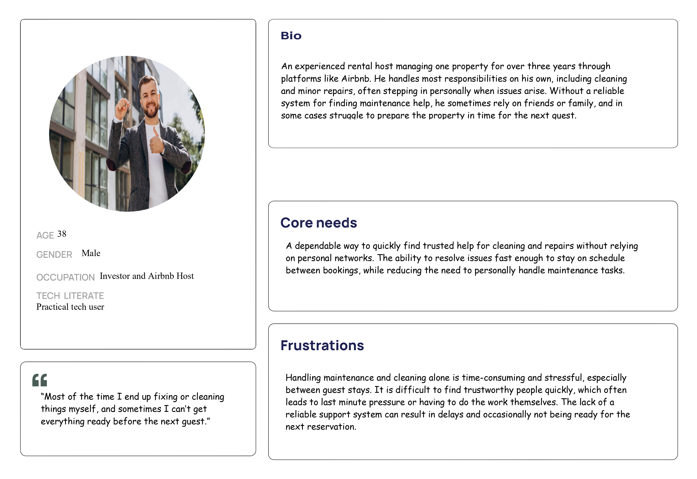

# FixStay 🛠️🏠  
**Short-Term Rental Maintenance Management Platform**

## 🎨 Figma Wireframes
**Dashboard pages wireframe:**
https://www.figma.com/design/qlVDDKQBmHYOd3VxrXWY8C/Wp2_Dashboards?node-id=11-2&t=4hLSHZpXSmQiCwQY-1

**Front page and login page:**
https://www.figma.com/design/y4BvoeRUi36GiM2clJin2a/Wp2_Front-page-and-login?node-id=2-179&t=cmwkBPMupOk7YCol-1

## 📌 Overview
FixStay is a role-based web application designed to simplify maintenance management for short-term rental properties. It connects guests, property hosts, and verified service providers, enabling fast issue reporting during a stay, seamless task monitoring, and transparent service execution.

---

## 🎯 Problem Statement
Short-term rental hosts often struggle to manage maintenance tasks efficiently, especially when issues arise unexpectedly during a guest's stay. Communication between guests reporting problems and hosts trying to coordinate with multiple service providers is fragmented, progress tracking is unclear, and service quality is hard to measure.

FixStay solves this by providing a centralized, database-driven platform where guests can easily report problems, hosts can quickly dispatch service requests, and providers can manage their tasks all in one place.

---

## 👥 User Roles
- **Guest (Renter)** 
- **Host (Property Owner)**
- **Service Provider** (Cleaner, Handyman, Electrician, etc.)
- **Admin**

---

## ⚙️ Core Functionalities

### 🔐 Authentication & Roles
- User registration and login
- Role-based access control (RBAC)

### 🛏️ Guest Features
- Report maintenance issues during their stay (e.g., no hot water, broken AC, etc.)
- Upload photos and descriptions of the problem
- Track the status of the reported issue (Reported -> Fixing -> Resolved)
- Communicate with the host regarding the timeline of the fix

### 🏠 Host Features
- Add and manage rental properties
- Receive and review issue reports submitted by guests
- Convert guest reports into maintenance requests (announcements) for service providers with category, priority, and photos
- Create manual maintenance requests (e.g., routine cleaning)
- Track task status in real time
- Receive notifications on task updates
- Review and rate service providers
- View maintenance history per property

### 🔧 Service Provider Features
- Create and manage service profile
- Monitor available maintenance tasks posted by hosts
- Filter tasks by location, service type, and urgency
- Accept or decline tasks
- Update task status (In Progress / Completed)
- Upload completion proof (photos, notes)
- Build reputation through ratings and reviews

### 🛡️ Admin Features
- Manage users and roles
- Verify service providers
- Moderate tasks and reviews
- View analytics and reports (response times, common issues, provider performance)

---

## 🔄 Task Lifecycle
1. **Guest reports an issue** (e.g., no hot water) during their stay.
2. **Host reviews the report** and posts a maintenance request (announcement) to the platform. 
3. **Service provider monitors** the announcements and accepts the task.  
4. **Provider fixes the issue**, updates progress, and uploads proof of completion.  
5. **Host confirms completion**, updates the guest that the issue is resolved, and leaves a review for the provider.  

---

## 🧩 User Stories

### 1. Guest – Reporting an Issue
As a guest currently renting a property,
I want to easily report an issue (like a broken appliance or missing hot water) directly to the host through the platform,
so that the problem can be acknowledged and fixed quickly without me having to make phone calls.

### 2. Host – Adding a New Property & Managing Requests
As a rental host,
I want to add a new short-term rental property and receive direct issue reports from my guests,
so that I can quickly turn those reports into job announcements for service providers and resolve my guests' problems fast.

### 3. Service Provider – Filtering & Accepting Tasks
As a verified service provider (handyman/cleaner),
I want to filter available maintenance tasks by location, category, and urgency level,
so that I can quickly accept only the jobs I’m skilled for and available to complete within my schedule.

### 4. Admin – Verifying a New Service Provider
As an administrator,
I want to review and approve a new service provider’s profile (documents, skills, location),
so that only trustworthy professionals can accept tasks and hosts can rely on the quality of the platform.

---

### Persona
After doing 2 interviews with property owners (hosts) we have come up with the following persona:
